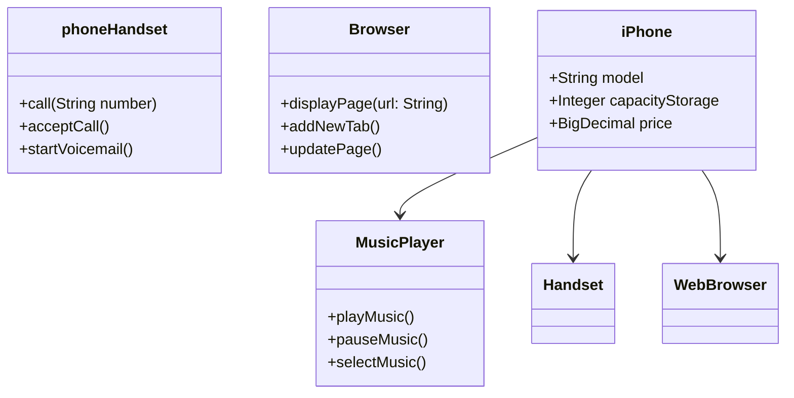

[PORTUGUÊS - pt-BR ](https://github.com/CaioAntonioJava/desafio-dio-iphone-uml/blob/main/README.md)
# POO Challenge - iPhone UML and Java implementation 📱

A challenge developed in collaboration between [Digital Innovation One](https://www.dio.me/) and the bank [Santander](https://www.santander.com.br/), it proposes exploring the functions of the iPhone through modeling in UML and implementation in Java, inspired by Steve Jobs' iconic 2007 conference. This project demonstrates how design, programming and innovation work together to create a revolutionary product.

## **Main Objectives**

- To highlight the revolutionary design of the iPhone;
- Provide a clear visual and technical representation of Apple's vision for the iPhone;
- Apply the fundamentals of Object-Oriented Programming (OOP) and Unified Modeling Language (UML).

## **Concepts Used in Development**

- Object-Oriented Programming (OOP);
- Classes and packages;
- Pillars of OOP (encapsulation, inheritance, etc.);
- Interfaces;
- Unified Modeling (UML).

With this background, we're going to model the functions of the iPhone as :
**Music Player 
**Telephone Device**,
and Internet Browser**.

**NOTE: We will include the Java implementations of the main components, demonstrating how the iPhone integrates these functionalities into a single device.

 
## UML diagram
Developed using [Mermaid](https://mermaid.js.org/) syntax, a JavaScript-based diagramming and graphics tool that processes Markdown-inspired text definitions to dynamically create and modify diagrams.

