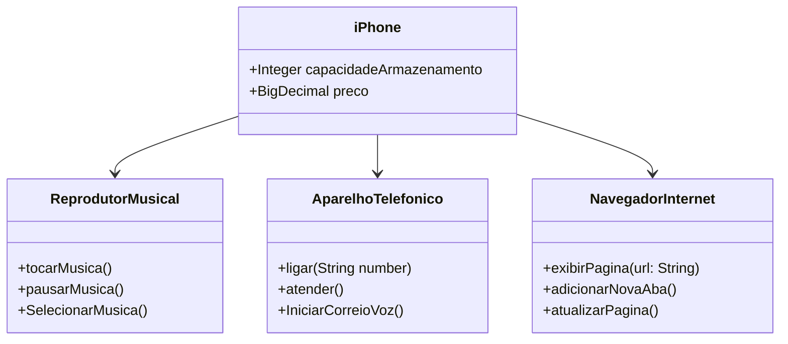

[ENGLISH](README.en.md)
# Desafio POO - Implementação iPhone UML e Java 📱

Desafio elaborado em colaboração entre [Digital Innovation One](https://www.dio.me/) e o banco [Santander](https://www.santander.com.br/), o mesmo propõe a exploração das funções do iPhone através de modelagem em UML e implementação em Java, inspirada na conferência icônica de 2007 de Steve Jobs. Este projeto demonstra como design, programação e inovação trabalham juntos para criar um produto revolucionário.

## **Objetivos Principais**

- Destacar o design revolucionário do iPhone;
- Providenciar uma representação visual e técnica clara da visão da Apple para o iPhone;
- Aplicar os fundamentos de Programação Orientada a Objetos (POO) e Linguagem de Modelagem Unificada (UML).

## **Conceitos Utilizados no Desenvolvimento**

- Programação Orientada a Objetos (POO);
- Classes e pacotes;
- PIlares do POO ( encapsulamento, herança e etc);
- Interfaces;
- Modelagem Unificada (UML).

Com essa base de estudos, vamos modelar as funções do iPhone como :
**Reprodutor Musical**, 
**Dispositivo Telefônico**,
e **Navegador de Internet**.

**NOTA:** Incluiremos as implementações em Java dos componentes principais, demonstrando como o iPhone integra essas funcionalidades em um dispositivo único.

## Ferramentas e Tecnologias

 
## Diagrama UML
Desenvolvido utilizando a sintaxe [Mermaid](https://mermaid.js.org/), uma ferramenta de diagramação e gráficos baseada em JavaScript que processa definições de texto inspiradas em Markdown para criar e modificar diagramas dinamicamente.

